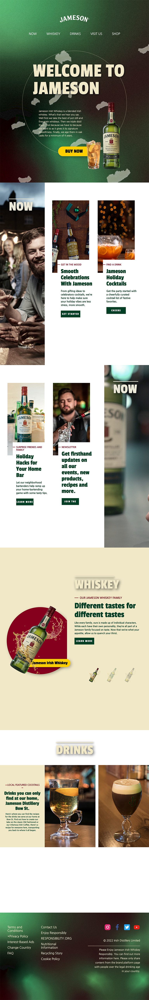
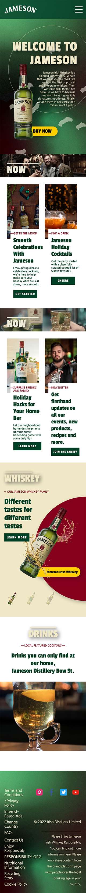

# publising_jameson
제임슨 위스키 반응형 웹 리디자인 (메인 페이지)

웹사이트 https://aewols.github.io/publising_jameson/
 비핸스 https://www.behance.net/gallery/156241557/2021-Web-Design-Jameson-Whiskey-

 

## 이미지
### PC 화면

### Tablet 화면

### Mobile 화면

 

## 소개
### About 제임슨 위스키

제임슨은 스코틀랜드 출신인 존 제임슨(John Jameson)이 1780년에 
 아일랜드 더블린에 세운 양조장에서 탄생한 브랜드입니다. 부드럽고 균형감
 있는 맛으로 칵테일 베이스로 추천하며, 아이리시 커피의 원재료로 가장
 사랑받는 브랜드입니다.

 

## 수행 내용
### 반응형 메인 페이지 제작 - HTML, CSS, jQuery를 이용한 UI 구현

* 레이아웃은 HTML5 시멘틱 태그로 구성
* jQuery를 활용한 각 페이지 콘텐츠에 맞춘 스크롤 효과 구현
* 이미지 또는 배너는 마우스 오버시 효과를 트렌지션 효과를 사용하여 구현
* 접근성과 편리성을 위한 웹 표준 준수
* 주요 브라우저에서 레이아웃이 호환 가능(크로스브라우징)
